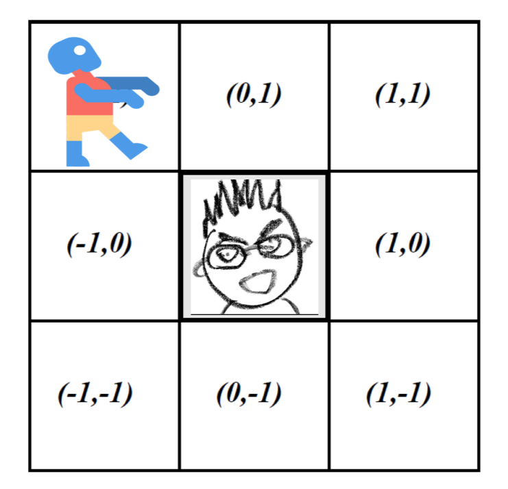
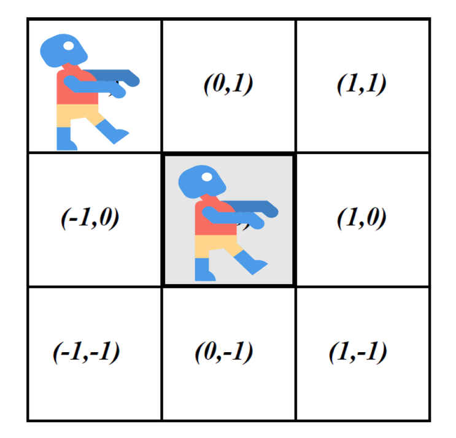
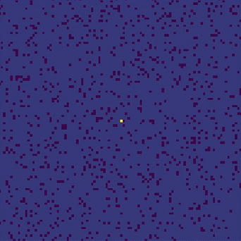

# Zombie apocalypse simulation via Moore neighborhood

## Introduction
The goal of this project was to investigate potential scenarios in the event of a zombie virus outbreak using a theoretical cellular automata model. Our model considered a population distributed among a 100 x 100 cell grid and used a Moore neighborhood. The population of cells is divided into three classes: normal (uninfected and unvaccinated), immune, and infected (the zombies). The infected population is further divided into three sub-categories for a total of five possible states for any given cell. We looked at the effect of an antidote being released based on a threshold number of infected. We investigated two different scenarios for releasing an “antidote/vaccine”. Infection and cure rates are based on probability parameters. By varying the antidote probability we obtained results for when the zombies would “win” by overrunning the grid or alternatively for when the survivors would “win” by maintaining a foothold and containing the infected group. We concluded that scenario one was preferable because a lower antidote probability was required then in scenario two. 

### Methodology - Moore Neighborhood

To study this system we employed a [cellular automata](https://en.wikipedia.org/wiki/Cellular_automaton) model to see how the virus might spread. Within the model we used a [Moore neighborhood](https://en.wikipedia.org/wiki/Moore_neighborhood), which is shown in below. We considered a set of rules defining the interaction between cells. The grey cell in the middle represents one of the normal people in our system. Once there is infected person in a cell around him, the normal person will become infected and turn into a zombie with severity levels defined by probabilities.

  


### Infections Rules
- 1. Infected people will turns into zombies with different levels Lv1, Lv2, Lv3. The higher level is, the lower probability will be of being able to cure them. The highest level, level 3, are considered incurable.
- 2. Antidote can only be developed after a period of time (threshold).
- 3. The person who has been injected the antidote will not be infected again (Immunity).
- 4. The antidote will be dropped to survivors at a random area by U.S Air Force.


### Design Scienarios 
- Scienario 1: The antidote will continue to drop to survivors randomly over the total uninfected area by the U.S Air Force.
- Scienario 2: The antidote will be dropped to survivors one time in a specific area by the U.S. Air Force. From there the antidote will spread among the other survivors, preventing them from becoming zombies, as well as potentially curing the level one and two zombies. Previously mentioned, level 3 zombies can not be cured. 

## Demo

### Senario 1


### Senario 2


## How to run 

Run Scenario 1

```bash
python3 Scenario 1.py
```
Run Scenario 2

```bash
python3 Scenario 2.py
```

## Customize Your Simuation

```python3
L = 100       #Total field size (100 ---> 100x100)
p = 0.9       #population density
p11 = 0.05    #probability of transforming into zombie lv1
p12 = 0.3     #probability of transforming into zombie lv2
p13 = 0.5     #probability of transforming into zombie lv3
p21 = 0.01    #probability of recovery rate of zombie lv1
p22 = 0.005   #probability of recovery rate of zombie lv2
p3 = 0.15     #probability of dropping rate about the antidote
awareness = 3000   #Threshold of dropping the antidote
r = 1         #Infection range of neighborhood
```
## Reference
- [Sayama, H. (2015). Introduction to The Modeling and Analysis of Complex Systems. Geneseo, NY: Open SUNY Textbooks, Milne Library, State University of New York at Geneseo.](https://textbooks.opensuny.org/introduction-to-the-modeling-and-analysis-of-complex-systems/)

## Team Member
Chun Yu Wu  
Tung-Ying Lee  
Nathaniel Lounsbury  
Xiaoman Guo
